  

<h1 align="center">Hi 👋, I'm Dhruv</h1>

<h3 align="center">🤖 AI/ML Engineer • Deep Learning • Full Stack • Automation</h3>

  

  
  &nbsp;
  

  

---

<h3><code>dhruv@github ~ $ ./contributions.sh</code></h3>

  

<h3><code>dhruv@github ~ $ whoami</code></h3>
<table>
  <tr>
    <td valign="top"></td>
    <td valign="top"></td>
  </tr>
</table>

  

<h3><code>dhruv@github ~ $ ./source-avatar.jpg</code></h3>

---

# 📊 GitHub Statistics

  
  

---

# 📈 Languages & Profile

  
  

---

# 📈 Contribution Graph

  

---

# 💻 Tech Stack

  

---

# ⚙️ Frameworks & Tools

  
  
  
  
  
  
  
  
  
  
  
  
  
  

---

# 🚀 About Me

- 🤖 Passionate about Artificial Intelligence and Machine Learning.
- 🌾 Building AI-powered Crop Yield Prediction systems.
- 📧 Developing intelligent Outlook Mail Automation tools.
- 🧠 Interested in Deep Learning, Computer Vision, and Large Language Models (LLMs).
- 💻 Building scalable Full Stack applications using FastAPI and React.
- 🚀 Always exploring new technologies and creating practical AI solutions.

---

# 🚀 Featured Projects

| Project | Description |
| --- | --- |
| 🌾 **ByteFarm** | AI-powered Crop Yield Prediction System |
| 📧 **Outlook Mail Automation** | Intelligent Email Automation with Python |
| ❤️ **Heart Disease Prediction** | End-to-End Machine Learning Classification |
| 🤖 **AI Automation Toolkit** | Python Automation Utilities & Productivity Tools |

---

# 🎯 Learning Now

🤖 AI · 📊 Data Visualization · ⚙️ ML/DL Core Concepts · 📘 Linear Algebra, Probability & Statistics, and Dijkstra's Algorithm

---

# 💬 Favorite Quote

> **"We don't build services to make money; we make money to build better services"**  
> — *Mark Zuckerberg*

  

